# Miniature

**Create visual thumbnails from high-dimensional imaging data using dimensionality reduction.**

Miniature applies dimensionality reduction (UMAP, t-SNE, or PCA) to multiplexed tissue imaging data and maps the low-dimensional embeddings to perceptually meaningful color spaces, creating intuitive visual representations of complex spectral data.

## Examples

### Input: Multiplexed Tissue Imaging (25 channels)

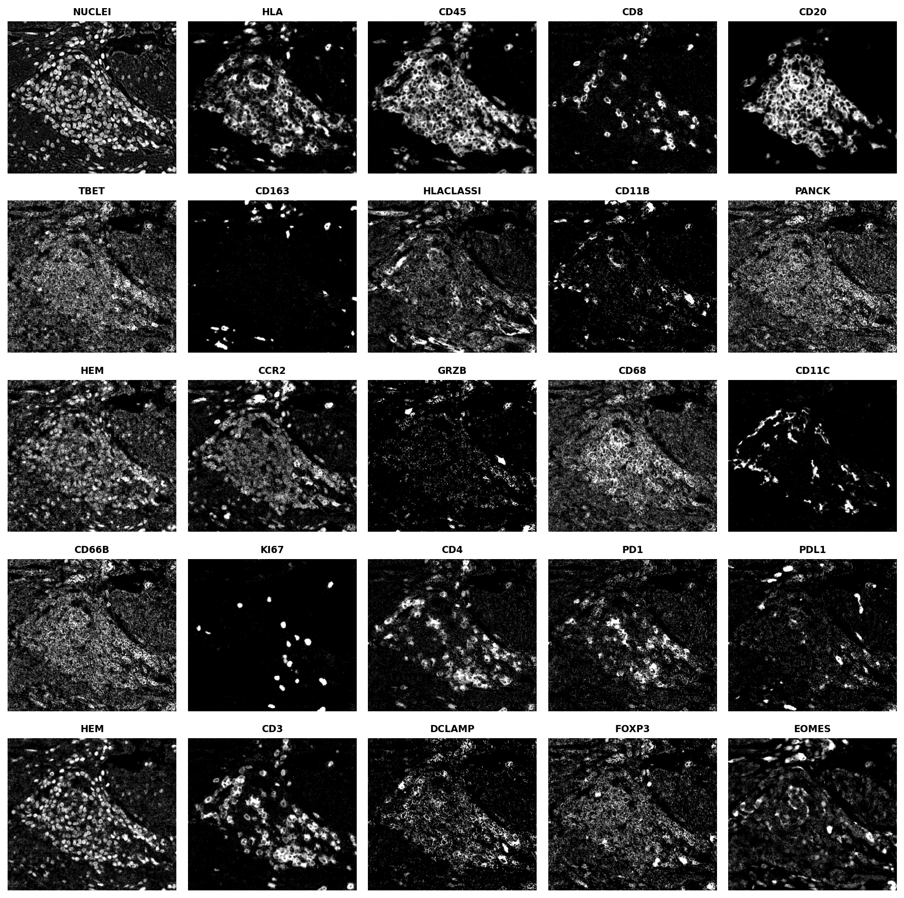

### UMAP Embeddings

| 3D Embedding | 2D Embedding |
|--------------|--------------|
| 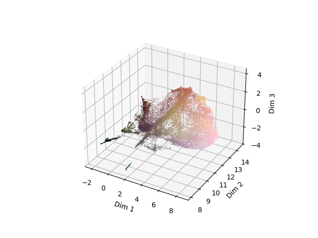 | 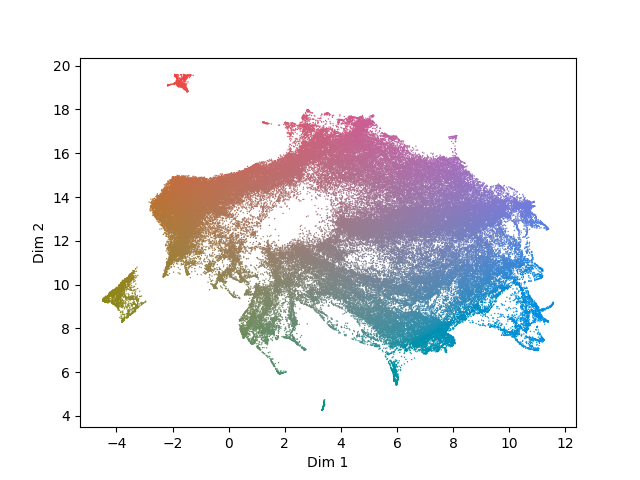 |

### 3D Colormap Outputs (UMAP → 3 components)

| LAB | RGB | OKLAB |
|-----|-----|-------|
| 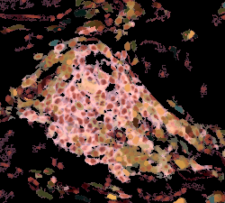 | 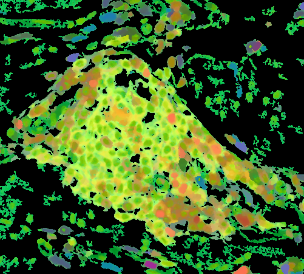 | 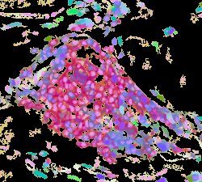 |

### 2D Colormap Outputs (UMAP → 2 components)

| BREMM | SCHUMANN | STEIGER |
|-------|----------|---------|
| 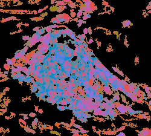 | 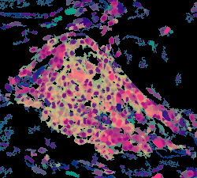 | 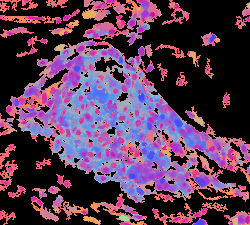 |

| TEULING2 | ZIEGLER | CUBEDIAGONAL |
|----------|---------|--------------|
| 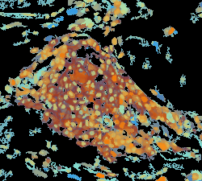 |  | 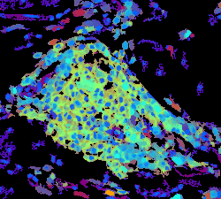 |

*Generated from multiplexed immunofluorescence tissue imaging data (WD-76845-003_ROI01).*

## Features

- **Multiple dimensionality reduction methods**: UMAP, t-SNE, PCA
- **Multiple color mappings**:
  - 3D embeddings: LAB, RGB, UCIE (Uniform Color in Embedding)
  - 2D embeddings: BREMM, SCHUMANN, STEIGER, TEULING2, ZIEGLER, CUBEDIAGONAL
- **Automatic pyramid level selection** for large images
- **Background removal** using Otsu thresholding
- **Quality metrics**: Trustworthiness and perceptual trustworthiness
- **Nextflow pipeline** for batch processing

## Installation

### From PyPI (coming soon)

```bash
pip install miniature
```

### From Source

```bash
git clone https://github.com/adamjtaylor/miniature.git
cd miniature
pip install -e .
```

### Optional Dependencies

```bash
# For UCIE colormap (optimization-based)
pip install -e ".[ucie]"

# For metrics calculation
pip install -e ".[metrics]"

# All optional dependencies
pip install -e ".[all]"
```

## Usage

### Command Line

```bash
# Basic usage with UMAP and LAB colormap
miniature input.ome.tiff output.png

# Use t-SNE with 2 components and a specific colormap
miniature input.ome.tiff output.png \
    --dimred tsne \
    --n_components 2 \
    --colormap BREMM

# Generate all colormaps and save intermediate data
miniature input.ome.tiff output.png \
    --colormap ALL \
    --save_data \
    --plot_embedding

# Keep background and apply log transform
miniature input.ome.tiff output.png \
    --keep_bg \
    --log \
    --pseudocount 1
```

### Python API

```python
import miniature

# Use core functions directly
from miniature import (
    pull_pyramid,
    remove_background,
    run_umap,
    assign_colours_lab,
    make_rgb_image,
)

# Load and process image
zarray = pull_pyramid("input.ome.tiff", max_pixels=512*512)
tissue_array, mask = remove_background(zarray, pseudocount=1.0)
embedding = run_umap(tissue_array, n=3, metric="euclidean")
rgb = assign_colours_lab(embedding)
image = make_rgb_image(rgb, mask)
```

### Command Line Options

| Option | Description | Default |
|--------|-------------|---------|
| `--dimred` | Dimensionality reduction method (umap, tsne, pca) | umap |
| `--n_components` | Number of embedding dimensions (2 or 3) | 3 |
| `--colormap` | Color mapping (ALL, LAB, RGB, UCIE, BREMM, etc.) | ALL |
| `--metric` | Distance metric for UMAP/t-SNE | euclidean |
| `--max_pixels` | Max pixels for pyramid level selection | 262144 |
| `--keep_bg` | Don't remove background | False |
| `--log` | Apply log10 transform | False |
| `--pseudocount` | Pseudocount for log transform | 1.0 |
| `--scaler` | Scaling method (MinMaxScaler, StandardScaler, RobustScaler) | None |
| `--save_data` | Save intermediate data to HDF5 | False |
| `--plot_embedding` | Save embedding visualization | False |
| `--optimize` | Apply UCIE-style rotation optimization | True |
| `--no-optimize` | Disable optimization, use direct scaling | - |

### Nextflow Pipeline

Create a samplesheet CSV:

```csv
filename,dimred,metric,log_arg,components,colormap,scaler
/path/to/image1.ome.tiff,umap,euclidean,--log,3,LAB,MinMaxScaler
/path/to/image2.ome.tiff,pca,euclidean,,3,RGB,NoScaler
```

Run the pipeline:

```bash
nextflow run nextflow/main.nf \
    --samplesheet samplesheet.csv \
    --outdir results \
    -profile docker
```

### Calculate Metrics

After generating miniatures with `--save_data`:

```bash
miniature-metrics output.h5 --metric euclidean --n 256
```

This calculates:
- **Embedding trustworthiness**: How well local structure is preserved
- **Perceptual trustworthiness**: How well the color mapping preserves perceptual relationships

## Color Mappings

### 3D Embeddings

- **LAB**: Maps embedding to CIE LAB color space (with rotation optimization by default)
- **RGB**: Direct mapping to RGB channels (with rotation optimization by default)

By default, both LAB and RGB use rotation optimization to maximize color space utilization while staying within sRGB gamut. Use `--no-optimize` for direct scaling without optimization.

### 2D Embeddings

Uses published bivariate colormaps:
- BREMM, SCHUMANN, STEIGER, TEULING2, ZIEGLER, CUBEDIAGONAL

## Output

- PNG thumbnail images
- Optional HDF5 file with:
  - `mask`: Binary mask of tissue pixels
  - `tissue_array`: Pixel × channel matrix
  - `embedding`: Low-dimensional coordinates
  - `colors/{colormap}`: RGB values for each colormap
- Optional embedding visualization plots

## Performance

Version 2.0 includes significant performance improvements:
- Vectorized color conversions using colour-science library
- Removed per-pixel multiprocessing overhead
- Optimized LAB to RGB conversion
- **Fast rotation optimization**: Uses ConvexHull half-space inequalities instead of Delaunay triangulation, achieving ~5-20x speedup
  - 100k point 3D optimization: ~6 seconds
  - 100k point 2D optimization: ~0.1 seconds

## Citation

If you use Miniature in your research, please cite:

> Taylor AJ, et al. (2024). Miniature: Unsupervised glimpses into multiplexed tissue imaging datasets as thumbnails for data portals.
> bioRxiv. doi: 10.1101/2024.10.01.615855

## License

MIT License
